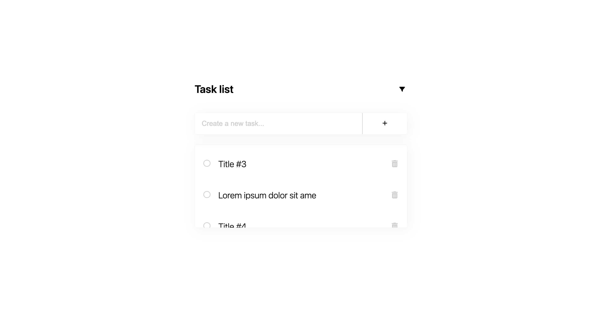
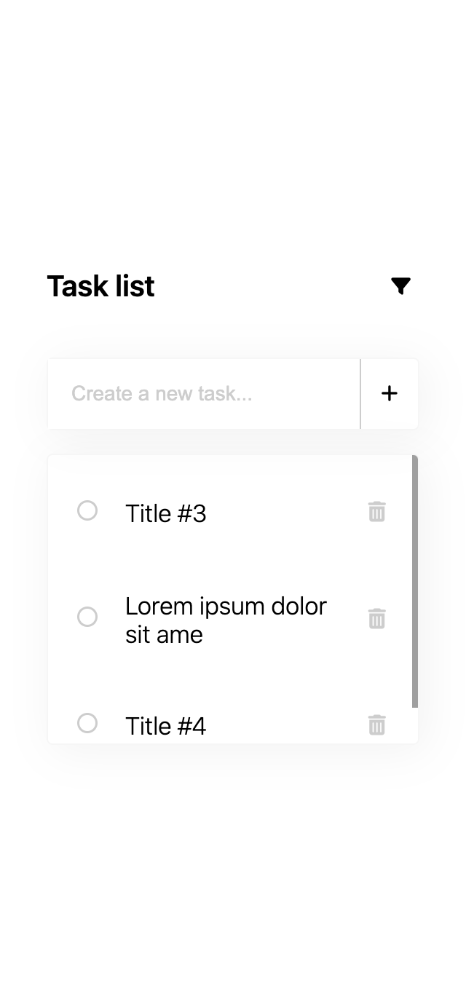

# Task List

## Technologies

## Description

Web app with simple user interface for storing and managing daily tasks.

## Installation

-   Clone Repository

    `git clone https://github.com/midjiro/task-list.git`

-   Cd to cloned repo

    `cd task-list`

-   Install dependencies

    `npm install`

-   Run json-server

    `npx json-server api/db.json --port 3001`

-   Create an .env file and configure the following variables

        `REACT_APP_SERVER_URI = "JSON-Server URL"

    REACT_APP_TITLE = "App Title"`

-   You're ready to run!

    `npm start`

## Contact

Hulak Mykhailo

[Send me an email](miha.gulak@gmail.com)

[Find me on telegram](https://t.me/@midjiro)

## Feature Development & Support

This project will no longer support
